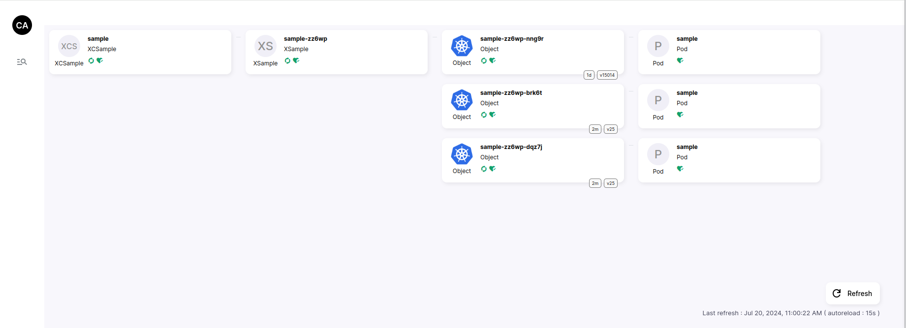

# crossplane-assistant

## What is crossplane-assistant?

Crossplane is visual tool to assiste you in the crossplane usage.
It helm you to observe crossplane entities in your cluster

## Screenshoot





## Install

### Helm

To install Crossplane-assistant with helm, you can use the following command:

```bash
helm install crossplane-assistant \
    --create-namespace \
    --namespace crossplane-assistant \
    ./charts/crossplane-assistant
```


## Usage docker

Launch the API and UI as docker

```
docker run --name crossplane-assistant-api  -p 8080:8080 ldassonville/crossplane-assistant-api:latest
docker run --name crossplane-assistant-ui -p 4200:8080 crossplane-assistant-ui:latest
```
then go on [crossplane-assistant-ui](http://localhost:4200)


## Build project

```bash
make docker-front
make docker-api
```

## Run in local

```bash
make docker front
make all-api
docker run -tid --name crossplane-assistant-ui -p 3000:8080 crossplane-assistant/crossplane-assistant-ui
./crossplane-assistant-api
```

Then go on [crossplane-assistant-ui](http://localhost:3000)
